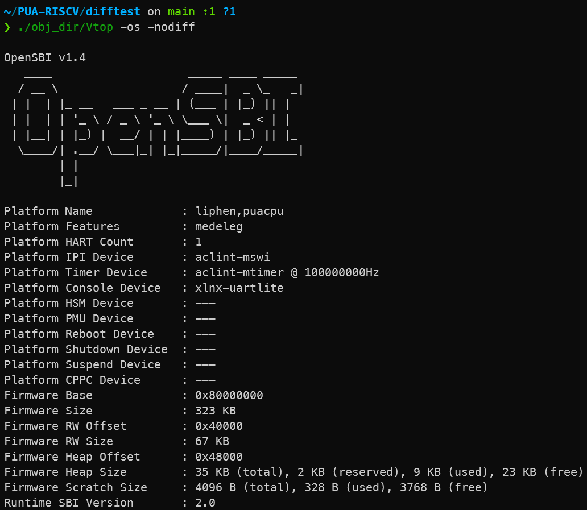
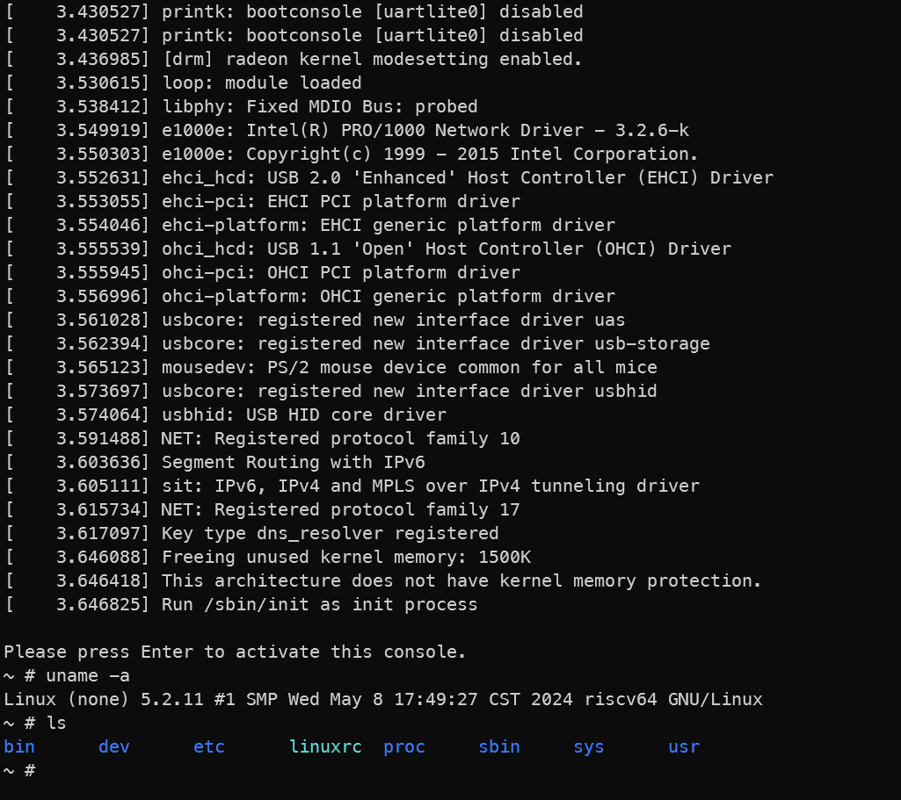

```
██████╗ ██╗   ██╗ █████╗       ██████╗ ██╗███████╗ ██████╗██╗   ██╗
██╔══██╗██║   ██║██╔══██╗      ██╔══██╗██║██╔════╝██╔════╝██║   ██║
██████╔╝██║   ██║███████║█████╗██████╔╝██║███████╗██║     ██║   ██║
██╔═══╝ ██║   ██║██╔══██║╚════╝██╔══██╗██║╚════██║██║     ╚██╗ ██╔╝
██║     ╚██████╔╝██║  ██║      ██║  ██║██║███████║╚██████╗ ╚████╔╝
╚═╝      ╚═════╝ ╚═╝  ╚═╝      ╚═╝  ╚═╝╚═╝╚══════╝ ╚═════╝  ╚═══╝
```

# 🚀 PUA (Powerful Ultimate Architecture) RISCV

[中文](README.md) | English

This project is the RISC-V branch of PUA-CPU.

For the MIPS branch of PUA-CPU, see [PUA-MIPS](https://github.com/Clo91eaf/PUA-MIPS).

## 📚 Introduction

- Supports the RV64IMAZicsr_Zifencei ISA with an in-order dynamic dual-issue five-stage pipeline.
- Can be integrated with the [differential testing framework](https://github.com/Ciliphen/riscv-difftest) to provide software simulation.

## 🛠️ Environment Setup

```bash
git clone git@github.com:Ciliphen/PUA-RISCV.git
cd PUA-RISCV
git submodule update --init --recursive
```

## 📦 Resources

1. 🎨 [Text to ASCII Art Generator](https://patorjk.com/software/taag/#p=testall&f=Graffiti&t=PUA-RISCV) - ASCII art generator

1. 🧰 [RISC-V Convertor](https://luplab.gitlab.io/rvcodecjs/) - RISC-V assembly converter

1. 📑 [Chisel Project Template](https://github.com/OSCPU/chisel-playground) - Chisel project template

## 📈 Progress

- [x] Implemented the RV64IMAZicsr_Zifencei ISA
- [x] Booted OpenSBI
- [x] Supports Linux (kernel version 5.2.11)

## 🖼️ Boot Showcase

### OpenSBI Boot



### Linux Boot


