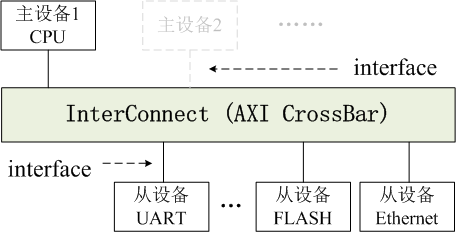
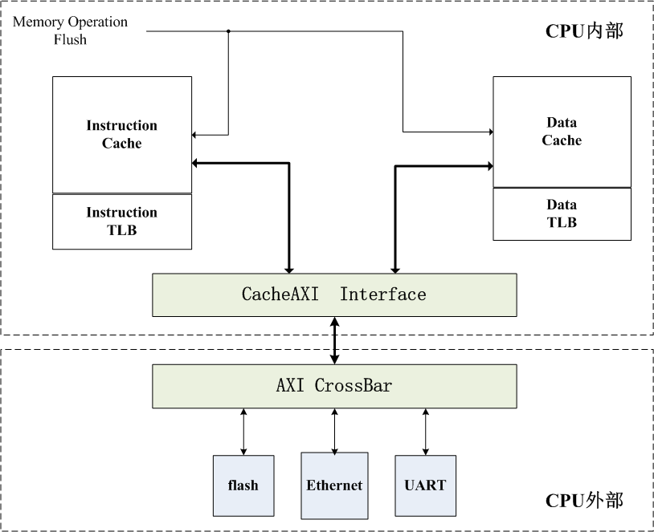

# AXI

## 信号

信号包含 AR（读请求通道）、R（读响应通道）、AW（写请求通道）、W（写数据通道）、B（写响应通道）

所有以 A 开头的信号都是包含地址信息的通道，如 AR 就是发送读地址的通道，AW 就是发生写地址的通道

### 信号宽度

下图为 PUA CPU 的 RISC V 64 实现中的 AXI 信号宽度

|   信号    | 宽度 |       功能       |   备注   |
| :-------: | :--: | :--------------: | :------: |
|  AXI_ID   |  4   |      ID 号       |          |
| AXI_ADDR  |  32  |       地址       |          |
| AXI_DATA  |  64  |       数据       |          |
| AXI_STRB  |  8   |    字节选通位    |          |
| AXI_RESP  |  2   |    操作的结果    |          |
|  AXI_LEN  |  8   | 传输长度（拍数） |          |
| AXI_SIZE  |  3   | （每拍）传输大小 |          |
| AXI_BURST |  2   |     传输类型     | 固定为 1 |
| AXI_LOCK  |  2   |      原子锁      | 固定为 0 |
| AXI_CACHE |  4   |    Cache 属性    | 固定为 0 |
| AXI_PROT  |  3   |     保护属性     | 固定为 0 |

### size 信号

axi 中的 size 决定了每一拍要取的数据长度

下图是 size 取值和传输数据大小的对应关系

| AxSIZE | Label |        Meaning         |
| :----: | :---: | :--------------------: |
| 0b000  |   1   |  1 byte per transfer   |
| 0b001  |   2   |  2 bytes per transfer  |
| 0b010  |   4   |  4 bytes per transfer  |
| 0b011  |   8   |  8 bytes per transfer  |
| 0b100  |  16   | 16 bytes per transfer  |
| 0b101  |  32   | 32 bytes per transfer  |
| 0b110  |  64   | 64 bytes per transfer  |
| 0b111  |  128  | 128 bytes per transfer |

对于 ICache 来说，指令长度是 32bit

- 当处于 uncached 段时 size 应该是 b010，一拍取 4 字节
- 处于 cached 段时应该和 AXI_DATA_WID 一致，这样可以保证最大量的取数据，应该是 $\rm log_2(AXI\_DATA\_WID/8)$
  - 比如 AXI_DATA_WID 为 64 时，$\rm log_2(64 / 8) = 3$，正好对应表里的 size 值 b011
  - AXI_DATA_WID 为 32 时，$\rm log_2(32 / 8) = 2$，对应表中的值 b010

### len 信号

用于控制传输的拍数，它的值就是需要传输的拍数减一

- 想传输 16 拍，那么设置 len 为 15，此时一共会得到$\rm (len+1)\times2^{size}$ 个 bytes 的数据

### burst 信号

用于控制传输类型

我们的实现中固定为 1，为 1 时是 INCR 类型，对于这种突发类型，每次传输的地址是上一次传输地址的增量。增量值取决于事务大小。设置为 1 的行为最简单

## 结构

我们 CPU 的访存结构如下图所示

我们可以看到 ICache 和 DCache 都和 Cache-AXI Interface 发生了交互，最后 Cache-AXI Interface 和 AXI CrossBar 间就只有一条数据线交互了

其中 ICache 只用于取指，所以只会使用到 AXI 的 AR 和 R，而 DCache 包含 load 和 store 两种操作，所以会用到所有 5 个通道

Cache-AXI Interface 的作用就是在 ICache 和 DCache 的发出的两个读请求（AR）中选择一个，并且把读响应（R）正确的发送到对应的 Cache 中；而对于 AW、W、B 只需要全部和 DCache 交互就行了；其实可以简单理解成通过 Cache-AXI Interface 这个转换桥将 CPU 从哈佛架构转为了冯诺依曼架构

