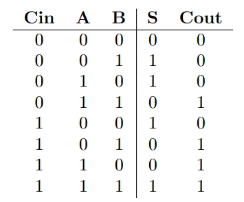

# 全加器

## 一、实验介绍

加法器是ALU（算术逻辑部件）的核心组成部分，它执行数字系统中最常见的运算——加法。减法可以看作是将被减数与取负后的减数进行加法运算。因此，加法器不仅能够执行加法，还可以同时实现减法运算。此外，通过移位相加的算法，加法器还可以实现乘法运算。因此，可以说加法器是计算机中最繁忙的部件之一。

本实验介绍如何使用Verilog编写全加器。

## 二、实验目的

1. 理解全加器的原理和功能。
2. 学会使用Verilog描述全加器的行为。
3. 掌握Verilog仿真工具的使用，验证全加器的正确性。

## 三、实验要求

1. 使用Verilog描述全加器的行为。
2. 通过所有测试点。

## 四、实验步骤

### 1. 框图


- `A` 和 `B` 是输入端口，表示要相加的两个二进制位。
- `Cin` 是输入进位端口，表示上一位的进位。
- `S` 也就是 `Sum` 是输出端口，表示相加结果的当前位。
- `Cout` 是输出进位端口，表示相加结果的进位。

### 2. 电路图


### 3. 真值表



### 4. 顶层模块

```verilog
module FullAdder (
         input wire A,
         input wire B,
         input wire Cin,
         output wire S,
         output wire Cout
       );

// TODO：你的代码实现

endmodule

```

在上述代码中，顶层模块名为 `FullAdder`，它有五个端口：

- `A` 和 `B` 是输入端口，表示要相加的两个二进制位。
- `Cin` 是输入进位端口，表示上一位的进位。
- `Sum` 是输出端口，表示相加结果的当前位。
- `Cout` 是输出进位端口，表示相加结果的进位。

请补充代码，完成全加器的设计。