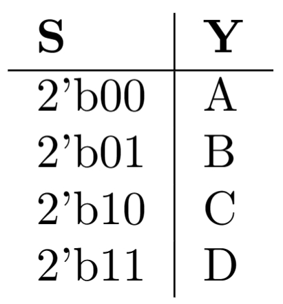

# 多路数据选择器

## 一、实验介绍

多路数据选择器（Multiplexer，简称 MUX）是一种数字电路组件，用于从多个输入数据信号中选择一个输出数据信号。它根据选择信号的值，将其中一个输入信号传递到输出。一个有 2*n* 输入端的数据选择器有 _n_ 个可选择的输入－输出线路，可以通过控制端来选择其中一个信号被选择作为输出。

本实验介绍如何使用 Verilog 编写多路数据选择器。

## 二、实验目的

1. 理解多路数据选择器的原理和功能。
2. 学会使用 Verilog 描述多路数据选择器的行为。
3. 掌握 Verilog 仿真工具的使用，验证多路数据选择器的正确性。

## 三、实验要求

1. 使用 Verilog 描述多路数据选择器的行为。
2. 通过所有测试点。

## 四、实验步骤

这里我们以四选一多路选择器举例：

### 1. 框图


- `A` 、`B` 、`C`  和 `D`是输入端口，表示输入的数据。
- `S` 是选择端口，用于选择输入的数据。
- `Y` 是输出端口，输出被选中的数据。

### 2. 真值表



在S分别取0、1、2、3的时候Y分别输出A、B、C、D的值。

### 3. 顶层模块

```verilog
module Mux4 #(
        parameter DATA_WIDTH = 8,
        parameter SELECT_WIDTH = $clog2(4) // $clog2(x)返回大于等于log2(x)的最小整数
    ) (
        input wire [DATA_WIDTH - 1: 0] A,
        input wire [DATA_WIDTH - 1: 0] B,
        input wire [DATA_WIDTH - 1: 0] C,
        input wire [DATA_WIDTH - 1: 0] D,
        input wire [SELECT_WIDTH - 1: 0] S,
        output reg [DATA_WIDTH - 1: 0] Y
    );

    // TODO：你的代码实现

endmodule

```

在上述代码中，顶层模块名为 `Mux4`，它有四个端口：

- `A` 、`B` 、`C`  和 `D`是输入端口，表示输入的数据。
- `S` 是选择端口，用于选择输入的数据。
- `Y` 是输出端口，输出被选中的数据。

其中我们使用了参数化的设计，这有利于我们对模块进行高效的拓展。

请补充代码，完成多路数据选择器的设计，使得多路数据选择器的行为满足真值表。
