# 认识Verilog

> 数字电路学习资料
>
> - [数字电路与计算机体系结构open in new window](https://pages.hmc.edu/harris/ddca/ddcarv.html) 1-5章节
> - [Verilog在线学习网站open in new window](https://hdlbits.01xz.net/wiki/Main_Page)，推荐边看书边练手
> - [中科大的Verilog OJ平台open in new window](https://verilogoj.ustc.edu.cn/oj/)(需要注册并登录)，推荐边看书边练手
> - 《CPU设计实战- 汪文祥 & 邢金璋》第3章节

## 一、什么是Verilog

[Verilog](https://zh.wikipedia.org/wiki/Verilog#%E5%8F%91%E5%B1%95%E5%8E%86%E5%8F%B2) 是一种**硬件描述语言**，用于描述和设计数字电路。它是一种结构化的编程语言，用于描述电子系统的行为和结构，以实现硬件设计和验证。

 Verilog是一种并发执行的语言，可以描述并行运行的硬件电路。Verilog中的模块可以以并行的方式执行，模块内的语句可以同时进行计算。相比C语言等非硬件描述的编程语言是一种顺序执行的语言，语句按照顺序逐步执行。因此，同学们在编写Verilog时，需要将原先C语言的一些思想抛弃，投入并行的怀抱。

## 二、面向硬件电路的设计思维方式

1. **并行和并发思维**: 硬件电路是并行执行的，多个电路元件可以同时工作。因此，在硬件设计中，需要考虑如何利用并行性和并发性，以实现高效的电路功能。
2. **抽象和模块化思维**: 硬件设计通常涉及复杂的电路结构和功能，因此，将电路设计分解为可管理的模块是很重要的。通过抽象和模块化思维，可以将复杂的电路问题分解为更小的部分，并逐步解决每个模块的设计和验证。
3. **时序和同步思维**: 时序是硬件设计中至关重要的概念。在考虑电路的功能时，需要仔细考虑元件之间的时序关系，包括时钟信号、触发器和时序逻辑等。同步思维强调设计中的时钟域和同步约束，确保电路的正确时序行为。
4. **优化和资源利用思维**: 硬件资源是有限的，因此，在设计电路时需要考虑如何优化资源的使用。这包括选择合适的元件、减少功耗、提高性能和资源共享等方面的思考。优化和资源利用思维可以帮助设计出更高效、更紧凑的电路。
5. **可靠性和容错思维**: 硬件电路通常要求高度可靠，能够在各种条件下正常工作。因此，设计时需要考虑如何处理异常情况、提供容错机制和错误检测、纠正等。可靠性和容错思维可以帮助设计出更稳定和可靠的电路。
6. **测试和验证思维**: 在硬件设计中，测试和验证是关键步骤，用于验证电路的正确性和性能。测试和验证思维强调设计过程中的测试计划、测试向量生成、仿真和验证技术等。通过充分考虑测试和验证，可以提高电路设计的质量和可靠性。

在本课程中，同学需要掌握的面向硬件电路的设计思维方式的核心实际上就是“**数据通路（Datapath）+控制逻辑（Control Logic）**”。**大家一定要先将电路设计想清楚，再开始写代码。我们建议采取“自顶向下、模块划分、逐层细化”的设计步骤。下**当大家已经想好了硬件的大致结构图，写代码实际上就是把结构图里的线一根根实现的过程。

## 三、Verilog程序的基本结构

此处假设大家已经有了C语言的基础，那么通过阅读代码其实是学习另一门语言最方便的途径。

Verilog 是区分大小写的。格式自由，可以在一行内编写，也可跨多行编写。每个语句必须以分号为结束符。空白符（换行、制表、空格）都没有实际的意义，在编译阶段可忽略。适当的进行换行和缩进有利于代码的阅读。

下面是实现二选一数据选择器的一个简单的例子。同时我也将介绍Verilog的三种建模方式。


```verilog
// 数据流建模
module Mux2 (
        input s,
        input in0, in1,  // 可以把功能类似的输入信号放在一起，这样写更清晰
        output out
    );
    assign out = in0 & ~s | in1 & s; // 将逻辑表达式直接写成赋值语句，这是数据流最典型的特点
endmodule

// 结构建模
module Mux2(
        input s,
        input in0, in1,
        output out
    );
    wire sl_n;
    wire out0, out1;
    not gate0(sl_n, s); // 此处实例化了多个名字为gate的门模块，通过连接各个模块进行建模
    and gate1(out0, in0, sl_n); // 第一个变量为输出，其他变量为输入
    and gate2(out1, in1, s); // not、and、or这些都是Verilog已经实现的门模块
    or gate3(out, out0, out1);
endmodule

// 行为建模
// 写法一
module Mux2(
        input s,
        input in0,
        input in1,
        output reg y // 此处定义的y为reg类型，在always语句中，只有reg类型才能被赋值
    );
    always @( * ) begin
        if (s == 0) begin // begin和end就相当于C语言中大括号的作用
            y = in0;
        end
        else begin
            y = in1;
        end
    end
endmodule
// 写法二
module Mux2 (
        input s,
        input in0, in1,   // 可以把功能类似的输入信号放在一起，这样写更清晰
        output out
    );
    assign out = s ? in1 : in0; // 这个写法很类似数据流建模，但是我们更多的对行为进行描述
endmodule

```

上面的代码简明的描述了一个两路的数据选择器的实现。

我们已经成功实现了一个二选一数据选择器，我们可以基于他实现一个四选一数据选择器。


当s1和s0分别为00、01、10、11时可以分别选择w0、w1、w2、w3。

```verilog
module Mux4 (
        input [1: 0] s,  // 定义了一个两位宽的s，使得可以其可以选择四路
        input [3: 0] w,  // 定义了一个四位宽的w，表示4个输入
        output out
    );
    wire out0, out1;
    // 下面实例化了三个我们之前实现了的Mux2模块，通过这样的组合，最终实现我们Mux4的功能
    Mux2 mux_1(.s(s[0]), .in1(w[0]), .in2(w[1]), .out(out0));
    Mux2 mux_2(.s(s[0]), .in1(w[2]), .in2(w[3]), .out(out1));
    Mux2 mux_fin(.s(s[1]), .in1(out0), .in2(out1), .out(out));
endmodule

```

## 四、Verilog的数据类型

基本数据类型包括了wire类型和reg类型。我们这里只介绍几种常用的数据类型，想了解更多的类型可以自己上网查阅。

下面我们也以实例进行介绍。

### 整数常量

整数常量的格式如下：

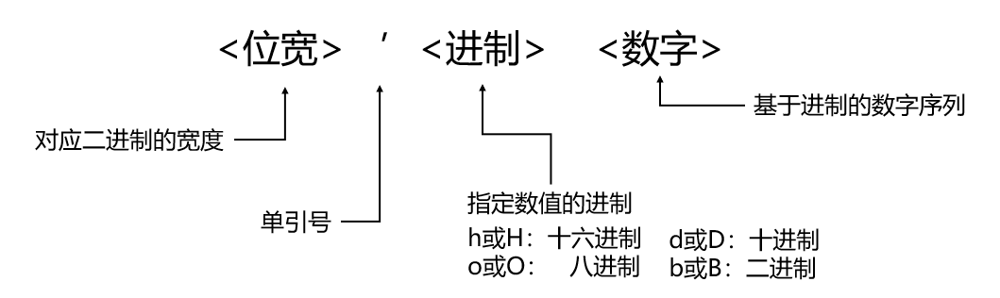

例子如：

```verilog
assign a = (b === 8'b00100101) ? 0 : 1;
```

其中 `8'b00100101`就是整数常量；当没有指定位宽时，综合器会自己自动判断位宽；当没有指定进制时，默认为十进制。

### wire类型

wire类型代表了在硬件电路中的连线，其特征就是输出的值紧随着输入值的变化而变化。

```verilog
wire a; // 定义了一个单位宽wire类型的信号
wire b;
wire c;
assign c = a & b; // 定义了一个单位宽wire类型c，其值为a和b的与
```

c的值会伴随着a、b的变化瞬间发生变化。

### reg类型

reg数据类型会放到过程语句中（例如always），通过过程赋值语句进行赋值。reg类型不一定必然会对应到硬件的寄存器，综合的时候会依据实际的情况使用连线或者寄存器来完成reg数据类型的功能。

```verilog
reg a; // 定义了一个单位宽的reg类型的信号
always @(posedge clock) begin
    a <= ~a; // 每当一个clock的上跳沿来时，a会取反
end

```

a的值只会在clock上跳沿来时发生变化，当clock不变时，a的值也不会发生变化。

```verilog
module Mux2(
        input s,
        input in0,
        input in1,
        output reg y // 此处定义的y为reg类型，在always语句中，只有reg类型才能被赋值
    );
    always @( * ) begin
        if (s == 0) begin // begin和end就相当于C语言中大括号的作用
            y = in0;
        end
        else begin
            y = in1;
        end
    end
endmodule

```

这是我们之前见过的行为建模的Mux，此处的y虽然我们定义的是reg类型，最后经过综合后，y实际上是线网类型，毕竟我们的Mux是组合逻辑电路，怎么会包含寄存器呢。

### 向量

wire类型的向量：

```verilog
wire [0: 7] a; // 通过这种写法可以定义一个8位宽的信号
wire [0: 7] b;
wire [0: 15] c;
wire [0: 3] d;
wire f;
assign c = {a, b}; // 使用大括号可以将两种信号进行拼接，此时a为c的高8位，b位c的低8位
assign d = a[0: 3]; // 使用冒号可以对信号进行切片，此时d为a的低4位
assign f = a[2]; // 此时f为a的第三位

```

reg类型的向量：

```verilog
reg [0: 7] cnt;
// 在clock和rst发生变化时，对cnt进行赋值
always @(posedge clock or posedge rst) begin
    if (rst) begin
        cnt <= 0; // 重置cnt
    end
    else begin
        cnt <= cnt + 1; // cnt自增
    end
end

```

### 数组

在 Verilog 中允许声明 reg, wire等类型及其向量类型的数组。

数组维数没有限制。线网数组也可以用于连接实例模块的端口。数组中的每个元素都可以作为一个标量或者向量，以同样的方式来使用，形如：**<数组名>[<下标>]**。

数组的定义：

```verilog
reg [3: 0] counter [3: 0] ; // 由4个4bit计数器组成的数组
wire [7: 0] addr_bus [3: 0] ; // 由4个8bit wire型变量组成的数组
wire data_bit[7: 0][5: 0] ; // 声明1bit wire型变量的二维数组
reg [31: 0] data_4d[11: 0][3: 0][3: 0][255: 0] ; // 声明4维的32bit数据变量数组
```

数组的赋值：

```verilog
counter[3] = 4'hF ; // 将数组counter中第4个元素的值赋值为4bit 十六进制数F，等效于counter[3][3:0] = 4'hF，即可省略宽度;
assign addr_bus[0] = 8'b0 ; // 将数组addr_bus中第一个元素的值赋值为0
assign data_bit[0][1] = 1'b1; // 将数组data_bit的第1行第2列的元素赋值为1，这里不能省略第二个访问标号，即 assign data_bit[0] = 1'b1; 是非法的。
data_4d[0][0][0][0][15: 0] = 15'd3 ; // 将数组data_4d中标号为[0][0][0][0]的寄存器单元的15~0bit赋值为3
```

### 参数

参数可以使得我们的模块更具有拓展性，下面是一个简单的例子：

```verilog
module Mux4to1 #(
        parameter WIDTH = 8 // 定义了参数WIDTH表示数据的宽度
    ) (
        input wire [WIDTH - 1: 0] A,
        input wire [WIDTH - 1: 0] B,
        input wire [WIDTH - 1: 0] C,
        input wire [WIDTH - 1: 0] D,
        input wire [1: 0] Sel,
        output reg [WIDTH - 1: 0] Y
    );
    always @ ( * )
    case (Sel)
        2'b00:
            Y = A;
        2'b01:
            Y = B;
        2'b10:
            Y = C;
        2'b11:
            Y = D;
    endcase
endmodule

```

## 五、Verilog的运算符

Verilog提供了一系列运算符，用于在硬件描述中执行各种算术、逻辑和位操作。以下是Verilog中常见的运算符类型：

1. 算术运算符：

   - `+`：加法运算符。
   - `-`：减法运算符。
   - `*`：乘法运算符。
   - `/`：除法运算符。
   - `%`：取模（取余）运算符。

     注：`*`, `/`, `%`一般不用在电路设计中，因为他们会被综合器综合成一个时序很差的电路，大大影响硬件性能。
2. 位操作运算符：

   - `&`：按位与运算符。
   - `|`：按位或运算符。
   - `^`：按位异或（XOR）运算符。
   - `~`：按位取反运算符。
   - `<<`：左移运算符。
   - `>>`：右移运算符。
3. 逻辑运算符：

   - `&&`：逻辑与运算符。
   - `||`：逻辑或运算符。
   - `!`：逻辑非运算符。
4. 比较运算符：

   - `==`：等于运算符。
   - `!=`：不等于运算符。
   - `>`：大于运算符。
   - `<`：小于运算符。
   - `>=`：大于等于运算符。
   - `<=`：小于等于运算符。
5. 赋值运算符：

   - `=`：非阻塞赋值运算符。
   - `<=`：阻塞赋值运算符。
6. 条件运算符：

   - `? :`：条件运算符 (ternary operator)，也称为三元运算符。例如：`a ? b : c` 表示如果 `a` 为真，则结果为 `b`，否则结果为 `c`。

此外，Verilog还提供了其他运算符，如拼接运算符 `{}`, 重复运算符 `{}`, 范围运算符 `[]` 等，用于位操作和信号处理。

```verilog
wire [0: 7] a;
wire [0: 31] b;
wire [0: 3] c;
wire [0: 7] d;
// 重复运算的例子
assign b = {4{a}}; // 等价于b = {a, a, a, a}，b由a重复4次组成
// 拼接运算的例子
assign a = {d[7: 4], c}; // a的高4位为d的高4位，低4位为c
```

上面只是Verilog中一些常见的运算符类型，根据具体需求和应用，可能会使用更多的运算符。请在编写代码时参考Verilog语言规范以获取完整的运算符列表和详细的语法规则。

### 运算符优先级

|           运算符           | 优先级 |
| :------------------------: | :----: |
| \+, \-, \!, \~（一元操作） |  最高  |
|            \*\*            |        |
|          \*, /, %          |        |
|     \+, \-（二元操作）     |        |
| \<\<, \>\>, \<\<\<, \>\>\> |        |
|     \<, \<\=, \>, \>\=     |        |
| \=\=, \!\=, \=\=\=, \!\=\= |        |
|          \&, \~\&          |        |
|       \^, \^\~, \~\^       |        |
|          \|, \~\|          |        |
|            \&\&            |        |
|            \|\|            |        |
|            ? :            |  最低  |

需要注意的是，Verilog中的运算符可能具有不同的优先级和结合性。

```verilog
assign res[31: 0] = a[31: 0] + b[0] && c[0]; // 其结果是1bit的结果
assign res[31: 0] = (a[31: 0] + b[0]) && c[0]; // 这两个语句等效
```

为了确保表达式的正确求值，可以使用括号来明确运算符的优先级和结合性。

## 六、Verilog的赋值语句

赋值语句可以说是任何一门编程语言的最基本的部分。在Verilog中，赋值语句包括了持续赋值语句和过程赋值语句。持续赋值语句在过程外使用，与过程语句并行执行。过程赋值语句在过程内使用，串行执行，用于描述过程的功能。

### 持续赋值语句

在Verilog中使用assign作为持续赋值语句使用，**用于对wire类型的变量进行赋值**。其对应的硬件也非常好理解，即通过对输出进行赋值，当输入变化的时候，经过一定的延迟，输出就会按照assign所描述的那样发生变化。

例如：

```verilog
assign out = in0 & in1;
```

在这个例子中，输入in0和in1，输出out都是wire类型的变量。当两个输入的任意一个发生变化的时候，输出out都会发生变化。

当然，这样的一个变化不会是立即的，而是需要经过一定的延迟，因为任何一种电路都会有延迟。

在一个模块中，可以有多个assign的持续赋值语句，这些持续赋值都是**并行执行**的，一旦赋值语句中的任何信号发生变化，那么这个赋值语句的输出信号（赋值等号的左边那个信号）就会跟着变化。

一个模块的持续赋值语句和前面所说的always过程语句都是可以出现多次的，他们之间的执行关系也是并行的，对应于电路上的信号值的变化。不同的是assign持续赋值语句由于表达能力的限制，只能反映一些简单的变化，而always过程语句则可以复杂很多，用以描述复杂的输出信号和输入信号的关系。

### 过程赋值语句

在过程里面的赋值语句被称为是过程赋值语句，一般用来对reg类型的变量进行赋值。

在always里使用的语句就是过程赋值语句，**只有reg类型的变量才能在always语句中被赋值**。

过程赋值语句分为两种类型，一个是非阻塞赋值语句（\<=），一个是阻塞赋值语句（=）。大家一定要注意对这两种赋值语句的区分，很多的bug可能就是过程赋值语句写错导致的。下面向大家介绍一下他们的区别：

#### 1. 非阻塞赋值语句（\<=）

非阻塞赋值语句在赋值语句出现的地方不是立即发生的，而是等到整个过程块结束的时候才发生。由于不是立即发生的，在过程内的描述中，仿佛这条语句不存在一样，因此被称为是非阻塞的。只是在过程的最后会执行所有的非阻塞赋值语句，在这个执行的过程中，所有的右值会维持原来的值不变。

```verilog
module example (
        input clk,
        input rst,
        input in,
        output reg result
    );
    reg a, b;
    always @(posedge clk, posedge rst) begin
        if (rst) begin
            a <= 0;
            b <= 0;
            result <= 0;
        end
        else begin
            a <= in;
            b <= a;
            result <= b;
        end
    end
endmodule

```

在这串代码中，经过rst重置，a、b、result的值为0。

此时若在clk上跳沿来时，输入in为1的值：此时，a、b和result会**同步被赋值**分别为1、0、0；下一拍输入in为0，此时a、b和result分别为0、1、0。这个模块相当于实现了一个延迟输出的功能，每个in信号要经过3个clk后才能传递出来。

大家需要好好思考一下同步赋值。这和C语言里的串行运行的概念十分不同。

再看下面这个例子可能更加容易理解：

```verilog
reg a, b;
always@(posedge clk) begin
    a <= b;
    b <= a;
end

```

这串代码实现的功能是，每个clk上跳沿来时，a和b的值会互相交换；假如a和b分别为0和1，当clk上跳沿来时，a、b会被赋值为1和0；

#### 2. 阻塞赋值语句（=）

阻塞赋值语句在赋值语句出现的地方就立即完成赋值操作，左值立刻发生变化。一个块语句中存在多条阻塞赋值语句的话，这些阻塞赋值语句会按照先后顺序关系，一条一条的执行，前面的赋值语句没有执行完，后面的赋值语句不会执行。这样的一种行为模式，就跟网络IO编程中的阻塞函数调用方式一样，一定要完成函数执行之后，这个函数调用才会退出。

下面再来看看和刚刚类似的例子：

```verilog
module example (
        input clk,
        input rst,
        input in,
        output reg result
    );
    reg a, b;
    always @(posedge clk, posedge rst) begin
        if (rst) begin
            a <= 0;
            b <= 0;
            result <= 0;
        end
        else begin // 只对这里的赋值语句进行了修改
            a = in;
            b = a;
            result = b;
        end
    end
endmodule

```

我们将非阻塞赋值语句改成阻塞赋值语句后，此处的赋值操作是串行赋值的。当clk上跳沿来时，a先赋值为in，等a赋值完后，b赋值为a的值也就是in，result同理也赋值为in的值。此处的赋值顺序就和C语言中语句的执行顺序一致。

```verilog
reg a, b;
always@(posedge clk) begin
    a = b;
    b = a;
end

```

使用阻塞赋值语句，我们就不能实现之前那样交换信号值的功能了。a和b的值会一直相等。

#### 3. 建议

always语句块有两种形式：

```verilog
// 时序逻辑
always@(posedge ...) begin
    ...
    end

// 组合逻辑
always@( * ) begin
    ...
    end

```

我们建议**在时序逻辑电路中只使用非阻塞赋值语句（\<=）进行赋值，在组合逻辑电路中只使用阻塞赋值语句（=）进行赋值**，这样可以大大减小出bug的几率。

## 七、Verilog的过程语句

以always为标志的是Veilog的过程语句，其有两种形式：

```verilog
// 时序逻辑
always@(posedge ...) begin
    ...
    end

// 组合逻辑
always@( * ) begin
    ...
    end

```

在时序逻辑中使用posedge或negedge表示上跳沿触发或下跳沿触发。

我们建议在编写的代码中尽量只使用一种触发类型，如上跳沿触发或者下跳沿触发。混用两种触发类型会大大降低硬件的性能。

### 条件语句

begin，end就类似于C语言中的大括号，用于表示一个语句块。

条件语句在组合逻辑或者时序逻辑中都可以使用。

#### 1. if语句

```verilog
module Mux4(
        input [0: 1] s,
        input in0,
        input in1,
        input in2,
        input in3,
        output reg y
    );
    always @( * ) begin
        if (s == 0) begin
            y = in0;
        end
        else if (s == 1) begin
            y = in1;
        end
        else if (s == 2) begin
            y = in2;
        end
        else begin
            y = in3;
        end
    end
endmodule

```

#### 2. case语句

```verilog
module Mux4(
        input [0: 1] s,
        input in0,
        input in1,
        input in2,
        input in3,
        output reg y
    );
    always @( * ) begin
        case (s)
            0:
                y = in0;
            1:
                y = in1;
            2:
                y = in2;
            3:
                y = in3;
            default:
                y = 1'bx; // 默认输出高阻态
        endcase
    end
endmodule

```

### 循环语句

循环语句的用法和C语言类似：

```verilog
module adder(
        input [7: 0] a, b,
        input cin,
        output reg[7: 0] sum,
        output reg cout
    );
    reg c;
    integer i;
    always @ ( * ) begin
        c = cin;
        // 利用for循环实现重复的赋值语句
        for (i = 0; i < 8; i = i + 1 ) begin
            {c, sum[i]} = a[i] + b[i] + c;
        end
        cout = c;
    end
endmodule

```

## 八、Verilog的建模方式

下面我想更详细得向大家介绍一下Verilog经典的三种建模方式，大家只需要稍加了解即可，因为在我们实际编写代码时，需要灵活的选用各种方法，没必要将他们分的那么开，在不同的场景不同的方法各有优势。

### 1. 数据流建模

数据流建模是基于信号传输和逻辑运算的思想，通过描述信号之间的流动和逻辑关系来建立数字电路的模型。在Verilog中，可以使用连续赋值语句来实现数据流建模。

数据流建模中的连续赋值语句使用赋值操作符 `=`，将右侧的表达式的值赋给左侧的信号。这种赋值是连续进行的，即当右侧的信号发生变化时，左侧的信号会立即更新。

以下是一个简单的Verilog模块，使用数据流建模方式描述一个2输入AND门的功能：

```verilog
module AndGate(
        input wire a,  // wire可以省略
        input wire b,
        output wire y
    );
    assign y = a & b; // 使用assign语句对wire类型的变量进行赋值
endmodule

```

在上述代码中，`a`和 `b`是输入信号，`y`是输出信号。`assign`语句将 `y`赋值为 `a & b`，表示 `y`的值等于 `a`和 `b`的逻辑与运算结果。

**在数据流建模中，信号之间的连接关系可以使用逻辑运算符和位运算符来描述。**常见的逻辑运算符包括与(`&`)、或(`|`)、非(`~`)等，而位运算符包括位与(`&`)、位或(`|`)、位异或(`^`)等。

通过使用Verilog的数据流建模，设计人员可以方便地描述和模拟数字电路的行为，从而实现功能验证和性能评估。

### 2. 结构建模

在Verilog中，可以使用实例化和端口连接的方式来实现结构建模。通过实例化，可以将已定义的模块实例化为具体的组件，并在实例化过程中连接各个组件的输入和输出端口。

**结构建模的特征就是模块的逐级实例化，有点像搭积木，先设计一个小的模块，再逐渐搭出大的模块。**


以下是一个简单的Verilog模块，使用结构建模方式描述一个2输入AND门的功能：

```verilog
module AndGate(
        input wire a,
        input wire b,
        input wire c,
        input wire d,
        output wire y
    );
    wire y1, y2;
    // 下面实例化了3个与门
    and and1(y1, a, b); // and是Verilog中的关键字，and1是实例名，y1是输出端口，a和b是输入端口
    and and2(y2, c, d);
    and and3(y, y1, y2);
endmodule

```

在上述代码中，我们使用Verilog自带的门语句实例化了3个与门，这种方式实现了一个4输入的与门。我们还可以通过这种方式，实例化两个已经实现的4输入与门，将其拼接得到一个8输入的与门。代码类似下面这样。接着你又可以实现一个16输入的与门……

```verilog
module AndGate8(
        input wire a,
        input wire b,
        input wire c,
        input wire d,
        input wire e,
        input wire f,
        input wire g,
        input wire h,
        output wire y
    );
    wire y1, y2;
    AndGate and1(.a(a), .b(b), .c(c), .d(d), .y(y1)); // 将已经实现的模块AndGate实例化
    AndGate and2(.a(e), .b(f), .c(g), .d(h), .y(y2)); // .a(e)表示将模块AndGate的输入端口a与当前模块的输入端口e相连
    and and3(y, y1, y2);
endmodule

```

通过结构建模，可以将数字电路分解为多个模块，并在层次结构中进行连接。这种模块化的设计方式使得电路的描述更加清晰和可维护，并且方便进行功能验证和调试。

除了实例化和端口连接，Verilog还提供了其他的结构建模方式，如使用连接运算符 `{}`进行信号连接，使用 `wire`和 `reg`声明中间信号等。这些方法可以根据具体的设计需求和设计风格进行选择和组合使用。

通过使用Verilog的结构建模，设计人员可以将数字电路按照模块化和层次化的方式进行描述，提高设计的可读性和可维护性，同时也方便进行功能验证和性能评估。

### 3. 行为建模

相比于前两种建模方式，行为建模用于描述数字电路的功能和操作，而不关注电路的具体结构和连线细节。它着重于描述电路的行为，包括组合逻辑和时序逻辑。对于复杂的硬件逻辑设计来说，使用行为级描述更为妥当，即直接描述出硬件所需要完成的功能，而不需要考虑这些硬件具体是如何实现的。具体如何实现交给EDA综合软件去做。

Verilog的行为建模可以分为两种类型：组合逻辑行为建模和时序逻辑行为建模。

1. 组合逻辑行为建模：
   组合逻辑行为建模用于描述电路中的组合逻辑部分，其中输出仅依赖于当前的输入。在组合逻辑行为建模中，可以使用 `always`块和 `assign`语句。

   以下是使用组合逻辑行为建模实现的一个二选一的数据选择器，当 `sel`为0时 `y`的输出等于 `a`；`sel`为1时为 `b`：

   ```verilog
   module Mux2to1(
           input wire sel,
           input wire a,
           input wire b,
           output wire y
       );
   
       reg f; // f是寄存器类型的输出信号，在always语句块中只有reg类型可以被赋值
   
       always @( * ) begin
           case (sel)
               1'b0:
                   f = a; // 注意此处的赋值是使用等号的，与时序逻辑中的小于等于号不同
               1'b1:
                   f = b;
               default:
                   f = 1'bx; // 默认情况下，输出为未知（高阻态）
           endcase
       end
   
       assign y = f;
   
   endmodule
   
   ```
2. 时序逻辑行为建模：
   时序逻辑行为建模用于描述电路中的时序逻辑部分，其中输出不仅依赖于当前的输入，还依赖于过去的输入或电路内部的状态。在时序逻辑行为建模中，可以使用 `always`块和时序控制语句（如 `if`语句、`case`语句等）。

   以下是一个使用时序逻辑行为建模的例子，描述了一个简单的时序电路，其中输出取决于当前输入和过去的输入：

   ```verilog
   module SequentialLogic(
           input wire clk,
           input wire reset,
           input wire data,
           output reg q // 也可以直接将输出定义为reg类型
       );
   
       always @(posedge clk, posedge reset) // 注意此处括号内与组合逻辑行为建模的不同
       begin
           if (reset) // 当时钟信号clk上升沿到来时，如果reset为高电平，则将输出q赋值为低电平；
               q <= 1'b0; // 注意此处使用小于等于号
           else // 否则，将输出q赋值为输入data的值。
               q <= data;
       end
   
   endmodule
   
   ```

通过行为建模，设计人员可以更直观地描述数字电路的功能和操作，不需要关注具体的电路结构和连线细节。行为建模适用于功能验证、仿真和高层次的电路描述。

### 4. 总结

结构建模直接描述了硬件电路的结构，最为具体，但是不够抽象。数据流建模更加接近传统的逻辑设计，抽象程度中等。行为级描述只需要抽象描述一个硬件的功能单元完成什么样的功能即可，不需要说明硬件是如何构造的，最为抽象。在实际的设计过程中，这三种方式可以互相混合使用，针对不同的电路可以选择不同的描述方式。

## 九、Verilog的仿真

这里我推荐使用iverilog搭配gtkwave进行Verilog的仿真。其他的仿真工具还有varilator、vivado等，大家可以自行学习。

### 一个简单的仿真例子

大家先在vscode中安装 [digital ide](https://digital-eda.github.io/DIDE-doc-Cn/#/?id=digital-ide-version-030) 插件，按里面的要求完成相关配置。你还需要安装 [iverilog](http://bleyer.org/icarus/) 安装时会提醒你安装gtkwave，且安装时可以一键加入环境变量，十分方便。

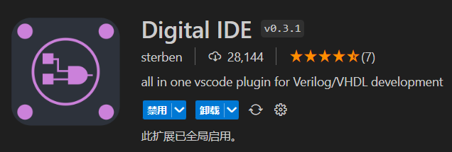

在安装完后点击左栏中的Digital-IDE图标。

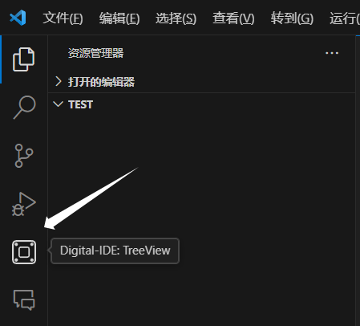

此时右下角会弹出这样的选项框，我们点击Yes。如果没弹出来，我们可以重启vscode试试。


此时我们的文件目录被更新成这样：

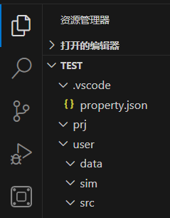

你可以按照插件文档修改property.json文件进行个性化配置。这里我就按默认进行示例展示：

我们在src中添加我们的Verilog代码。这里我们用四输入与门进行简单的实例。

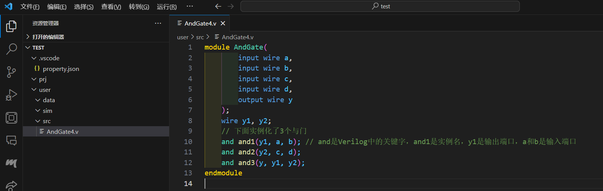

按下F1输入testbench：

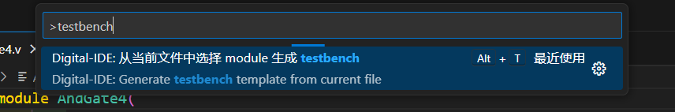

选中需要生成的模块：

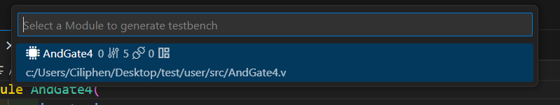

也可以右键快速生成：

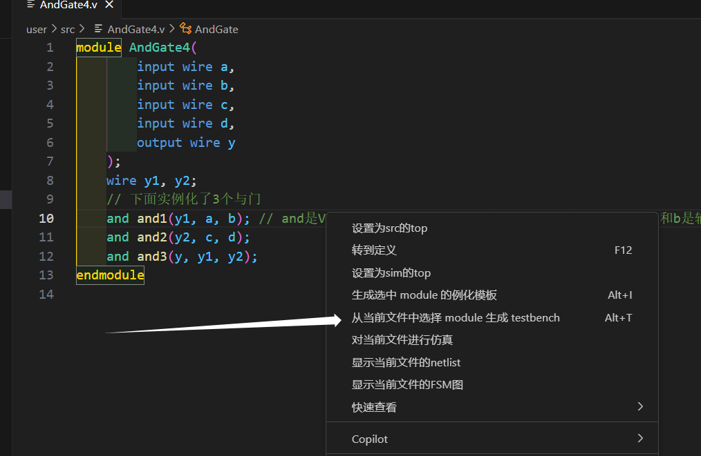

这时生成的testbench会被添加到sim文件夹中：

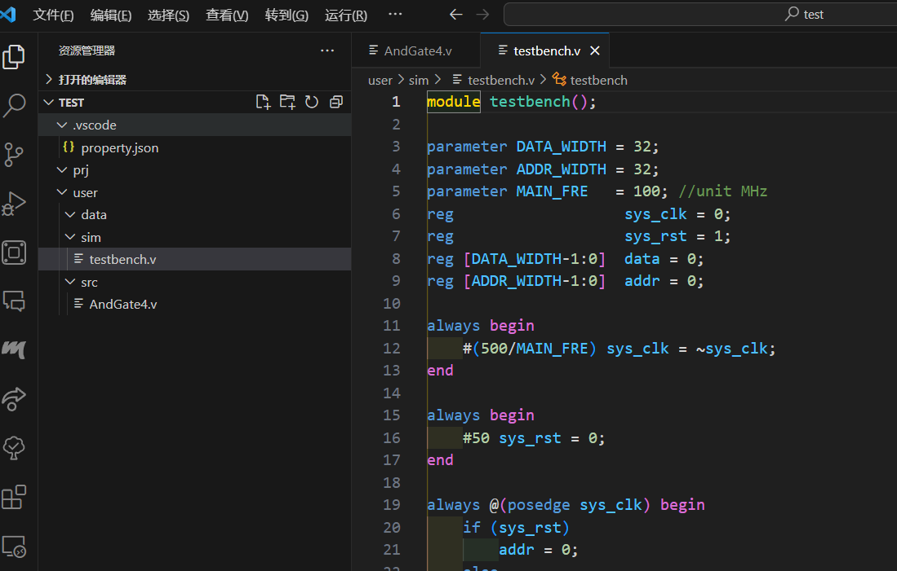

删去无用的信号，将testbench.v修改成我们需要的测试代码。

```verilog
module testbench();

    parameter  MAIN_FRE = 100; // unit MHz
    reg         sys_clk = 0;
    reg         sys_rst = 1;
    reg [0:3] test_data = 0; // 我们有4个输入，因此设置4位宽的test_data

    always begin
        #(500/MAIN_FRE) sys_clk = ~sys_clk;
    end

    always begin
        #50 sys_rst = 0;
    end

    always @(posedge sys_clk) begin
        if (sys_rst)
            test_data = 0;
        else
            test_data = test_data + 1;
    end

    // Instance
    // outports wire
    wire   	y;

    AndGate4 u_AndGate4(
        		 .a 	( test_data[0]  ), // 四输入的与门每个输入为test_data的一位
                 .b 	( test_data[1]  ),
                 .c 	( test_data[2]  ),
                 .d 	( test_data[3]  ),
                 .y 	( y             )
             );

    initial begin
        $dumpfile("wave.vcd");
        $dumpvars(0, testbench);
        #50000 $finish;
    end

endmodule  //TOP

```

修改完代码之后，我们右键选择仿真按钮：

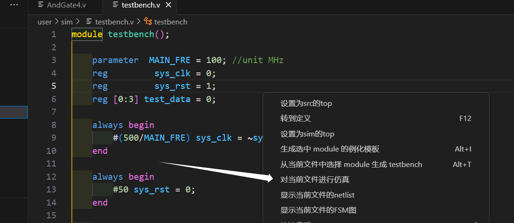

这时当前文件夹下会生成wave.vcd文件。

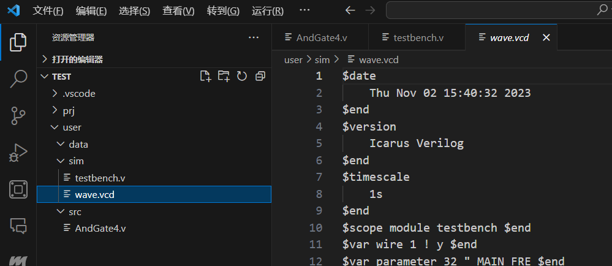

此时我们需要使用gtkwave工具将该文件打开。在终端中输入 `gtkwave.exe user/sim/wave.vcd` 此时系统会使用gtkwave软件打开该波形文件。

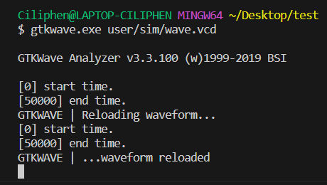

我们观察波形可以发现只有在a、b、c、d均为1时，y才为1，可见我们与门的实现是正确的。

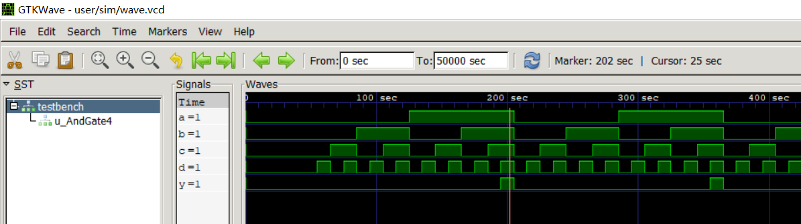

### 其他

当输入信号很多的时候，上面的那种写法肯定不合适了，因此还需要大家自己查阅资料，拓展一下这方面的知识

## 十、Verilog的一些建议和提醒

Verilog是一种可以用于仿真的语言，其中只有一部分可以被综合，一定要注意切勿将仿真相关的语句写入代码中。

经过仿真的例子大家应该简单了解了 [digital ide](https://digital-eda.github.io/DIDE-doc-Cn/#/?id=digital-ide-version-030) 插件的便利之处。大家可以仔细阅读配置文件，配置好编程环境，所谓工欲善其事必先利其器，好的工具能大大加速开发效率。
