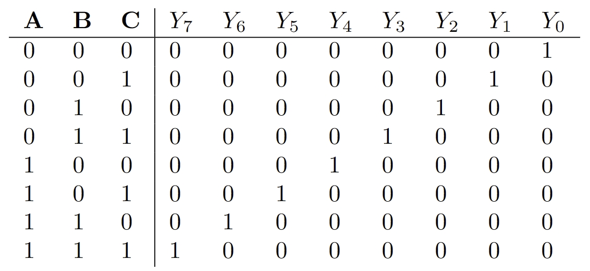

# 译码器

## 一、实验介绍

译码器（Decoder）是一种数字电路组件，用于将输入的编码信息转换为相应的输出信号。它的作用是解码输入信号，根据输入的编码模式选择并激活相应的输出线路。

译码器的工作原理是根据输入编码的模式选择并激活相应的输出线路。例如，一个 3-8 译码器接收 3 位二进制编码作为输入，根据输入编码的不同，选择并激活对应的输出线路。具体来说，如果输入编码为 `000`，那么译码器将激活输出线路 0；如果输入编码为 `001`，则激活输出线路 1，依此类推。

译码器广泛应用于数字系统和计算机中的多种场景，包括：

- 存储器访问：在存储系统中，译码器用于选择要读取或写入的存储单元。根据存储器地址的编码，译码器激活对应的存储单元。
- 显示驱动：在数码管显示或 LED 显示中，译码器用于将输入的数字编码转换为相应的数码管段或 LED 灯的亮灭控制信号。
- 地址解码：在计算机系统中，译码器用于将指令地址编码解码为特定的控制信号，以选择执行特定操作的电路路径。
- 数据选择和交换：在数据通路中，译码器用于选择不同的数据输入或输出路径，根据控制信号将数据流动到特定的目标。

## 二、实验目的

1. 理解译码器的原理和功能。
2. 学会使用 Verilog 描述译码器的行为。
3. 掌握 Verilog 仿真工具的使用，验证译码器的正确性。

## 三、实验要求

1. 使用 Verilog 描述译码器的行为。
2. 通过所有测试点。

## 四、实验步骤

这里我们以 3-8 译码器为例子：

### 1. 框图


- $A$ 、 $B$ 、 $C$ 是译码器的三个输入信号。
- $Y_0$ ~ $Y_7$ 是译码器的八个输出信号。
- $Y$ 的输出是二进制序列 $ABC$ 的十进制表示：当 $ABC$ 为 011 时对应的 $Y_3$ 输出为 1 其他为 0。

### 2. 真值表



### 3. 顶层模块

```verilog
module Decoder3_8(
        input wire A,
        input wire B,
        input wire C,
        output wire [7: 0] Y
    );

    // TODO：你的代码实现

endmodule

```

在上述代码中，顶层模块名为 `Decoder3_8`，它有四个端口：

- $A$ 、 $B$ 、 $C$ 是译码器的三个输入信号。
- $Y_0$ ~ $Y_7$ 是译码器的八个输出信号。
- $Y$ 的输出是二进制序列 $ABC$ 的十进制表示：当 $ABC$ 为 011 时对应的 $Y_3$ 输出为 1 其他为 0。

请补充代码，完成 3-8 译码器的设计。
