# 实现 R 型运算类指令的理想流水线设计实验

## 实验目的

1. 掌握 R 型运算类指令的数据通路
2. 掌握经典单发射五级流水线的设计方法
3. 掌握流水线 CPU 设计的编程基本框架

## 实验原理与实验内容

### 单周期与流水线

#### 结构差异

RISC-V 单周期 CPU 设计实现简单，控制器部分是纯组合逻辑电路，但该 CPU 所有指令执行时间均是一个相同的周期，即以速度最慢的指令作为设计其时钟周期的依据。如图 9.1 所示，单周期 CPU 的时钟频率取决于数据通路中的关键路径（最长路径），所以单周期 CPU 效率较低，性能不佳，现代处理器中已不再采用单周期方式，取而代之的是多周期设计方式。而多周期 CPU 设计中流水线 CPU 设计是目前的主流技术。

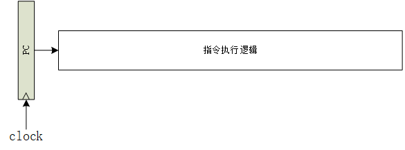

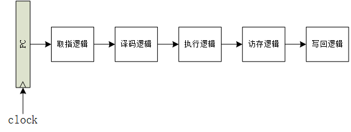

将电路流水线化的初衷是缩短时序器件之间组合逻辑关键路径的时延，在不降低电路处理吞吐率的情况下提升电路的时钟频率。从电路设计最终的实现形式来看，是将一段组合逻辑按照功能划分为若干阶段，在各功能阶段的组合逻辑之间插入时序器件（通常是触发器），前一阶段的组合逻辑输出接入时序器件的输入，后一阶段的组合逻辑输入来自这些时序器件的输出。

而将电路流水化最困难的地方是决定将单周期 CPU 中的组合逻辑划分为多少个阶段以及各个阶段包含哪些功能。这个设计决策需要结合 CPU 产品的性能（含主频）、功耗、面积指标以及具体采用的工艺特性来完成。对于初学者而言，这部分设计涉及的内容过多、过细、过深，因此我们将直接采用经典的单发射五级流水线划分。所划分的五级流水从前往后依次为：取指阶段（Fetch）、译码阶段（Decode）、执行阶段（Execute）、访存阶段（Memory）和写回阶段（WriteBack）。

1. 取指阶段的主要功能是将指令取回。
2. 译码阶段的主要功能是解析指令生成控制信号并读取通用寄存器堆生成源操作数。
3. 执行阶段的主要功能是对源操作数进行算术逻辑类指令的运算或者访存指令的地址计算。
4. 访存阶段的主要功能是取回访存的结果。
5. 写回阶段的主要功能是将结果写入通用寄存器堆。

结合这个流水线阶段的划分方案，我们将单周期 CPU 的数据通路拆分为五段（如图 9.2 所示），并在各段之间加入触发器作为流水线缓存，图 9.3 展示了 RISC-V 流水线的逻辑架构。

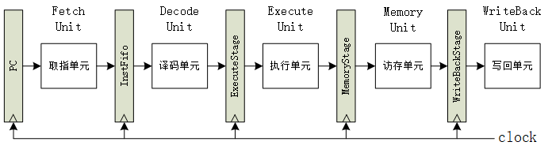

所有部件采用同一个系统时钟 clock 来同步，每到来一个时钟 clock，各段逻辑功能部件处理完毕的数据会锁存到下一级的流水线缓存中，作为下一段的输入数据，指令执行进入下一阶段。clock 频率的取决于流水线缓存两级间的最大逻辑延迟。

#### 性能差异

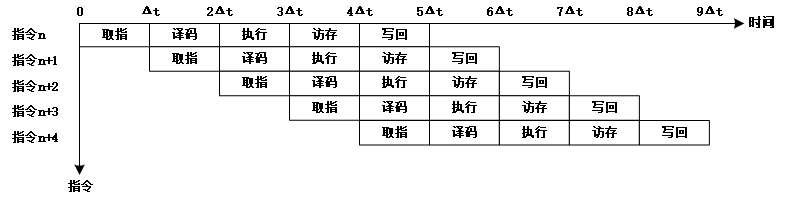

图 9.4 给出了 RISC-V 单周期 CPU 的时空图，可以看到，每条指令执行需要 5 个时钟周期，即 $\rm 5\Delta t$。1 个时钟周期是 1 个 $\rm \Delta t$ ，也就是每 5 个 $\rm \Delta t$ 可以提交 1 条指令，单周期 CPU 的 IPC 是 0.2。算出运行 n 条指令花费的总时间为 $\rm n\times 5\Delta t$ 。

图 9.5 给出了 RISC-V 理想的五级流水线 CPU 时空图。在理想情况下，当流水线满载运行时，每个时钟周期流水线可以提交 1 条指令，也就是 CPU 的 IPC 为 1。流水线完成 n 条指令的总时间为 $\rm (4+n)\times \Delta t$ 。

当 n 趋近于 $\rm \infty$ 时，相比单周期 CPU 执行 n 条指令花费的时间，五级流水线的加速比 $\rm \lim_{n \to \infty}S_p=\frac{5n\times \Delta t}{(4+n)\times \Delta t}=5$ ，即理想的五级流水线 CPU 的执行效率是单周期 CPU 的 5 倍。

### 数据通路设计

#### 设计的基本方法

经过之前的数字电路设计实验的学习，你应该掌握了数字逻辑电路设计的一般性方法。在计算机结构设计实验中，我们要设计的 CPU 也是一个数字逻辑电路，它的设计也应该遵循数字逻辑电路设计的一般性方法。CPU 不但要完成运算，也要维持自身的状态，所以 CPU 这个数字逻辑电路一定是既有组合逻辑电路又有时序逻辑电路的。CPU 输入的、运算的、存储的、输出的数据都在组合逻辑电路和时序逻辑电路上流转，我们常称这些逻辑电路为数据通路（Datapath）。因此，要设计 CPU 这个数字逻辑电路，首要的工作就是设计数据通路。同时，因为数据通路中会有多路选择器、时序逻辑器件，所以还要有相应的控制信号，产生这些控制信号的逻辑称为控制逻辑。所以，从宏观的视角来看，设计一个 CPU 就是设计它的“数据通路+控制逻辑”。

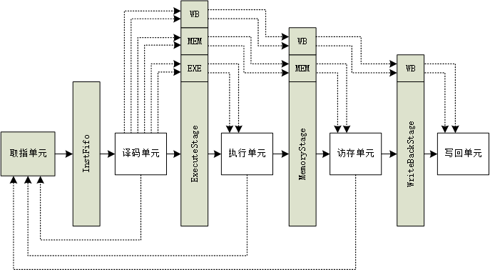

根据指令系统规范中的定义设计出“数据通路+控制逻辑”的基本方法是：对指令系统中定义的指令逐条进行功能分解，得到一系列操作和操作的对象。显然，这些操作和操作的对象必然对应其各自的数据通路，又因为指令间存在一些相同或相近的操作和操作对象，所以我们可以只设计一套数据通路供多个指令公用。对于确实存在差异无法共享数据通路的情况，只能各自设计一套，再用多路选择器从中选择出所需的结果。接下来，我们将遵循这个一般性方法，具体介绍如何分析指令的功能以及如何设计出数据通路。图 9.5 展示了 RISC-V 理想的五级流水线 CPU 数据与控制信号传递图。

#### 以 ADD 指令为例

我们来分析一下 ADD 指令需要哪些数据通路部件。

首先，我们需要得到 ADD 这条指令：需要使用这条指令对应的 PC 作为虚拟地址进行虚实地址转换，得到访问指令 SRAM 的物理地址。这意味着需要的数据通路部件有：取指单元、虚实地址转换部件和指令 SRAM。我们先对这部分的数据通路进行实现。

##### 前端

（1）取指单元

因为实现的是一个 64 位的处理器，所以 PC 的指令宽度是 64 比特。我们用一组 64 位的触发器来存放 PC。（后面为了行文简洁，在不会导致混淆的情况下，我们用 pc 代表这组用于存放 PC 的 64 位触发器。）由于我们的处理器使用到了 SRAM 进行数据的存取，而 SRAM 的特性是一次读数操作需要跨越两个时钟周期，第一个时钟周期向 RAM 发出读使能和读地址，第二个时钟周期 RAM 才能返回读结果。因此我们发送给指令 SRAM 的地址应该是下一拍的 PC，也就是 pc_next，而目前的实验设计 pc_next 的大小将一直等于 pc+4（这里的 4 代表寻址 4 个字节，即一条指令的宽度），因此 pc_next 和 pc 之间只是组合逻辑的关系。

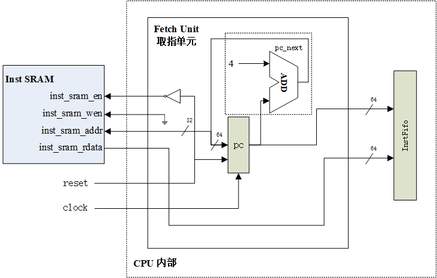

pc 的输出将送到指令 SRAM 中用于获取指令，由于我们的指令 SRAM 的地址宽度只有 32 位，因此只有 pc 的低 32 会被使用。目前来看，PC 的输入有两个，一个是复位值 0x80000000（由于发送给指令 SRAM 的是 pc_next，所以 pc 的真正复位值其实是 0x80000000-0x4），一个是复位撤销之后 pc_next 的值。

因为取指单元只会对内存进行读操作，因此 inst_sram_en 只要在 reset 无效时使能即可，而 inst_sram_wen 应该恒为低电平。图 9.6 展示了取指单元的结构。

（2）虚实地址转换

任何时候 CPU 上运行的程序中出现的地址都是虚地址，而 CPU 本身访问内存、I/O 所用的地址都是物理地址，因此我们需要对 CPU 发出的虚拟地址进行转换，使用物理地址进行访存。在实现 RISC-V 的 S 模式之前，目前我们实现的 CPU 的虚拟地址与物理地址之间使用直接映射的方式，即物理地址的值等于虚拟地址的值。因此虚实地址转换部件目前可以先省略。

（3）指令 RAM

得到取指所需的物理地址后，接下来就要将该地址送往内存。我们采用片上的 RAM 作为内存，并且将 RAM 进一步分拆为指令 RAM 和数据 RAM 两块物理上独立的 RAM 以简化设计。

指令 RAM 输出的 32 位数据就是指令码。本书中我们实现的 CPU 采用小尾端的寻址，所以指令 RAM 输出的 32 位数据与指令系统规范中的定义的字节顺序是一致的，不需要做任何字节序调整。

（4）指令队列

我们将 Fetch/Decode 之间的流水线缓存称为指令队列。我们将指令队列之前的阶段称为前端，将指令队列之后的阶段称为后端。当取指单元一次取指的数量大于译码单元可以解码的数量时，又或是后端流水线发生暂停时，取指单元可以继续取指，多余的指令可以在指令队列中排队等待，而不用暂停取指。通过指令队列这个部件可以解耦前后端。

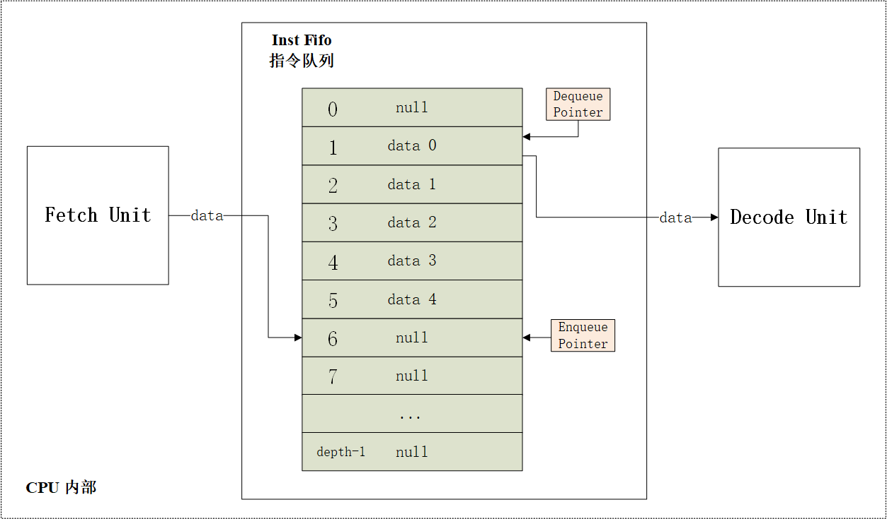

如图 9.7 所示，指令队列的实现是一个深度为 depth 的寄存器组，每个寄存器中保存一个叫做 data 的数据包（目前我们需要保存指令的内容以及指令的 PC 这两个数据），宽度应该和 data 的宽度一致。出队指针和入队指针都是一个宽度为 $\rm log_2(depth)$的寄存器。我们使用出队指针指示队列的头部，入队指针指示队列的尾部。由取指单元发送的数据存入入队指针指示的寄存器；出队指针指示的寄存器保存的数据发送到译码单元中。目前我们实现的是理想流水线，因此每一个 clock 我们的入队指针和出队指针都应该加 1，发生 reset 时，两个指针都应该置为 0。

##### 后端

前端部分我们已经成功取得指令，接下来我们需要通过译码识别出这条指令为 ADD 指令，并产生相应的控制信号。

（5）译码单元

译码单元要完成指令译码和源操作数的准备这两个操作，指令译码由译码器完成，源操作数通过访问通用寄存器堆获得。

a）译码器

首先我们要明白译码器是如何解码不同指令的。RISC-V 有 6 种指令格式，如图 9.8 所示。译码器根据指令的 opcode 段识别出指令的格式，再进行下一步的译码。

在本实验中，我们只需要实现 R 型的运算指令。图 9.9 展示了 RV64 中所有 R 型运算指令。我们先分析非字指令，不难发现，R 型运算指令的 opcode 是 0110011，再通过 func3 区别各指令的运算类型，其中 ADD 和 SUB、SRL 和 SRA 的 func3 一致，再由 func7 的第 6 位进行区分。而字指令的分析也和非字指令的分析一致。

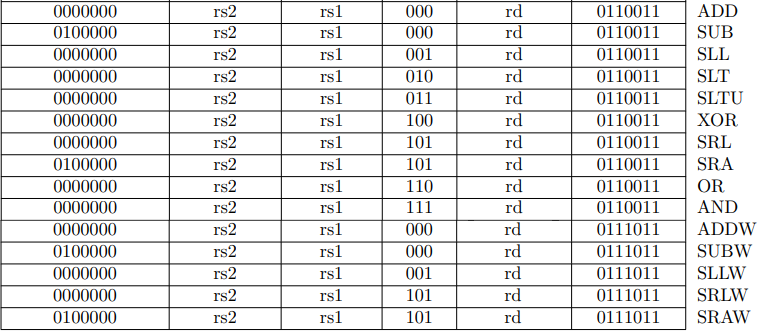

R 型运算指令都是三地址指令，每条指令都有两个源操作数以及一个目的操作数。我们记源操作数 1 为 src1，源操作数 2 为 src2。

因此译码器中要产生的控制信号如下：

- src1_ren：src1 是否需要读通用寄存器堆
- src1_raddr：src1 的通用寄存器堆读地址
- src2_ren：src2 是否需要读通用寄存器堆
- src2_raddr：src2 的通用寄存器堆读地址
- op：指令的操作类型
- reg_wen：是否需要写回通用寄存器堆
- reg_waddr：通用寄存器堆的写地址

接下来我们应该阅读手册，根据手册对指令功能的定义对各控制信号进行赋值。图 9.10 展示了 ADD 指令的定义。

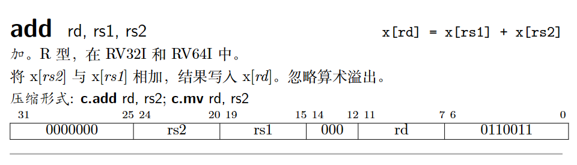

ADD 指令的源操作数都来自通用寄存器堆，因此 src1_ren 和 src2_ren 都为 1，src1_raddr 对应指令的 19 至 15 位，src2_raddr 对应指令的 24 至 20 位。

ADD 指令需要写回通用寄存器堆，因此 reg_wen 为 1，reg_waddr 对应指令的 11 至 7 位。

因为目前我们要实现的指令都在执行单元的 ALU 中进行运算，因此只需要将 op 设置正确就能完成指令的区分。op 的设置有多种方法，下面介绍两种：

1. 简单的方法：

   直接将指令从 0 开始按顺序编号，如 ADD 为 1、SUB 为 2、SLL 为 3 ……

2. 稍微复杂一些的方法：

   观察指令格式进行 op 的设计，比如非字指令的 opcode 一致，仅 func3 以及 func7 的第 6 位有区别，那么我们可以将这几位进行拼接，由于 ADD 又有 ADD 和 ADDW 的区别，因此我们可以再加一位进行字指令的区分，因此 ADD 的 op 可以设计为 0 0 000。按这种思路，SRAW 的 op 就是 1 1 101。

不同的 op 设计对于 FU（Function Unit，功能部件）内部的解码会有一定的影响，我们等下在 ALU 的设计中会进行介绍。

完成了控制信号的生成，接下来我们需要准备源操作数，也就是访问通用寄存器堆，相比 SRAM 这种存储类型，通用寄存器堆的访问都是当拍完成。

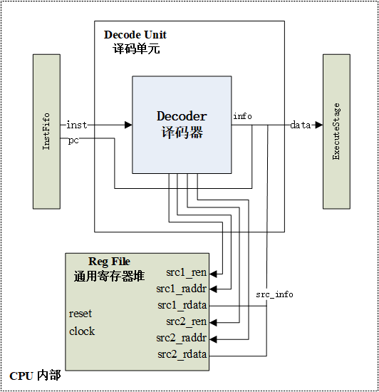

图 9.11 展示了译码单元的结构，译码器将从指令队列获得的指令进行译码，产生了相关的控制信号，与寄存器堆读回的源操作数以及指令队列获得的 pc 一起打包成一个 data 数据包发送至下一级流水线缓存。

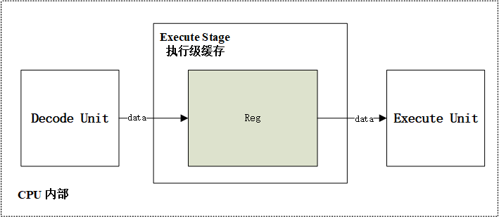

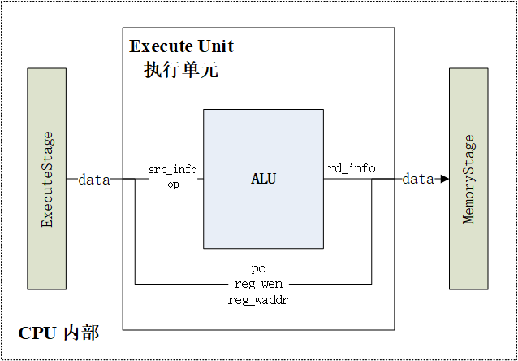

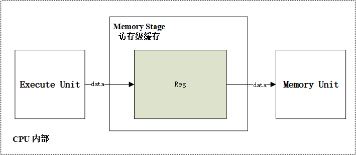

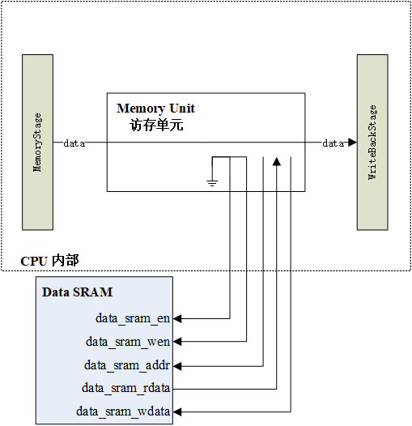

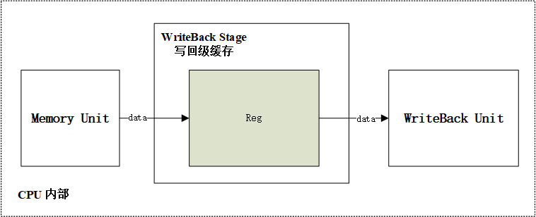

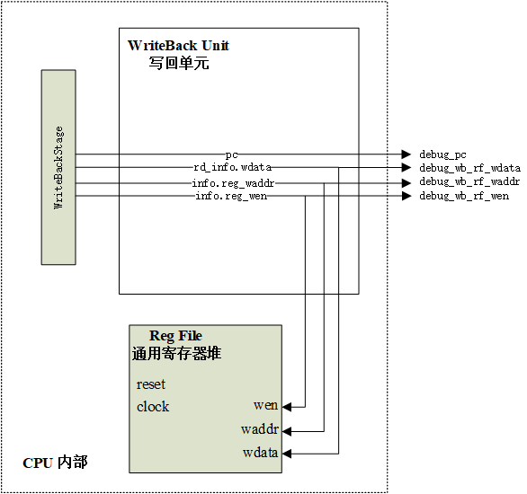

### 差分测试

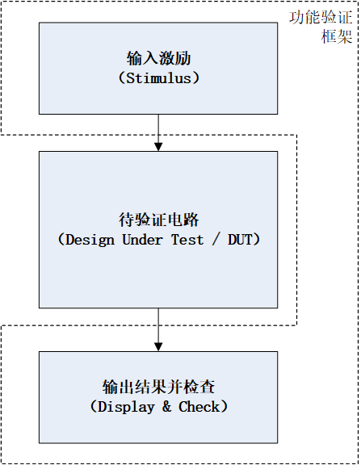

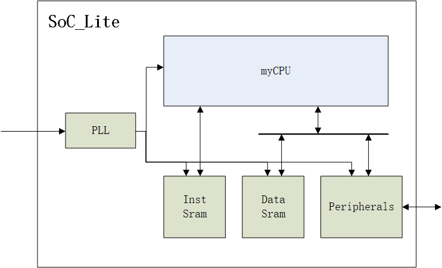

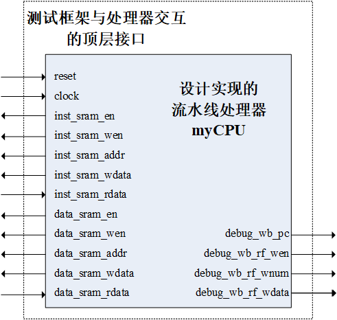

## 实验要求

1. 根据本实验提供的五级流水线编程框架，在流水线 CPU 中添加以下指令：ADD、SLL、SLT 、SLTU、XOR 、SRL 、OR、AND 、SUB 、SRA
2. 通过本实验提供的所有测试用例

## 实验步骤

1. 如何打开工程文件进行编程
2. 如何使用模拟器进行仿真
3. 如何提交测评

## 思考与探索

1. RISC-V 指令集是定长指令集吗？（否，实现 C 拓展后会有压缩指令）
2. RV64 和 RV32 的 R 型运算指令是否有区别？（指令格式无区别，但运算数据的长度有区别）
3. SLT 和 SLTU 这类比较指令的实现是为了什么目的，比如是为了实现什么样的目标才有了这类指令？（方便实现大数计算的进位操作）
4. SLL、SRL 和 SRA 这三条指令在 src2 高 63 至 6 位不全为 0 的时候，指令的执行结果是什么？（手册规定只需要看 src2 低 6 位即可，高位忽略）
5. RISC-V 的运算指令有进行运算结果的溢出判断吗，为什么要这样设计？可以对比 MIPS 指令集进行说明（无溢出判断，相比 MIPS 少了 ADDU 等不判断溢出的指令，应该是为了节省指令编码空间，况且溢出判断可以用软件实现）

