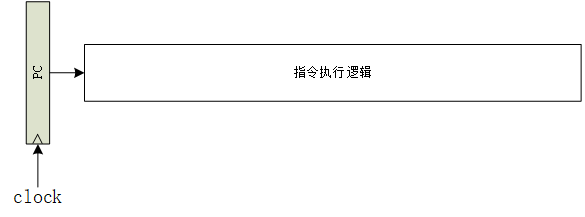

# 实现 R 型运算类指令的理想流水线设计实验

## 实验目的

1. 掌握 R 型运算类指令的数据通路
2. 掌握经典单发射五级流水线的设计方法
3. 掌握流水线 CPU 设计的编程基本框架

## 实验原理与实验内容

### 单周期 CPU 与流水线 CPU 结构的差异

RISC-V 单周期 CPU 设计实现简单，控制器部分是纯组合逻辑电路，但该 CPU 所有指令执行时间均是一个相同的周期，即以速度最慢的指令作为设计其时钟周期的依据。如图 9.1 所示，单周期 CPU 的时钟频率取决于数据通路中的关键路径（最长路径），所以单周期 CPU 效率较低，性能不佳，现代处理器中已不再采用单周期方式，取而代之的是多周期设计方式。而多周期 CPU 设计中流水线 CPU 设计是目前的主流技术。

将电路流水线化的初衷是缩短时序器件之间组合逻辑关键路径的时延，在不降低电路处理吞吐率的情况下提升电路的时钟频率。从电路设计最终的实现形式来看，是将一段组合逻辑按照功能划分为若干阶段，在各功能阶段的组合逻辑之间插入时序器件（通常是触发器），前一阶段的组合逻辑输出接入时序器件的输入，后一阶段的组合逻辑输入来自这些时序器件的输出。

而将电路流水化最困难的地方是决定将单周期 CPU 中的组合逻辑划分为多少个阶段以及各个阶段包含哪些功能。这个设计决策需要结合 CPU 产品的性能（含主频）、功耗、面积指标以及具体采用的工艺特性来完成。对于初学者而言，这部分设计涉及的内容过多、过细、过深，因此我们将直接采用经典的单发射五级流水线划分。所划分的五级流水从前往后依次为：取指阶段（Fetch）、译码阶段（Decoder）、执行阶段（EXE）、访存阶段（MEM）和写回阶段（WB）。

1. 取指阶段的主要功能是将指令取回。
2. 译码阶段的主要功能是解析指令生成控制信号并读取通用寄存器堆生成源操作数。
3. 执行阶段的主要功能是对源操作数进行算术逻辑类指令的运算或者访存指令的地址计算。
4. 访存阶段的主要功能是取回访存的结果。
5. 写回阶段的主要功能是将结果写入通用寄存器堆。

结合这个流水线阶段的划分方案，我们将单周期 CPU 的数据通路拆分为五段（如图 9.2 所示），并在各段之间加入触发器作为流水线缓存（如图 9.3 所示）。

所有部件采用同一个系统时钟 clock 来同步，每到来一个时钟 clock，各段逻辑功能部件处理完毕的数据会锁存到下一级的流水线缓存中，作为下一段的输入数据，指令执行进入下一阶段。clock 频率的取决于流水线缓存两级间的最大逻辑延迟。图 9.3 展示了 RISC-V 流水线的逻辑架构。

经过之前的数字电路设计实验的学习，你应该掌握了数字逻辑电路设计的一般性方法。在计算机结构设计实验中，我们要设计的 CPU 也是一个数字逻辑电路，它的设计也应该遵循数字逻辑电路设计的一般性方法。CPU 不但要完成运算，也要维持自身的状态，所以 CPU 这个数字逻辑电路一定是既有组合逻辑电路又有时序逻辑电路的。CPU 输入的、运算的、存储的、输出的数据都在组合逻辑电路和时序逻辑电路上流转，我们常称这些逻辑电路为数据通路（Datapath）。因此，要设计 CPU 这个数字逻辑电路，首要的工作就是设计数据通路。同时，因为数据通路中会有多路选择器、时序逻辑器件，所以还要有相应的控制信号，产生这些控制信号的逻辑称为控制逻辑。所以，从宏观的视角来看，设计一个 CPU 就是设计它的“数据通路+控制逻辑”。

那么，怎么根据指令系统规范中的定义设计出“数据通路+控制逻辑”呢？基本方法是：对指令系统中定义的指令逐条进行功能分解，得到一系列操作和操作的对象。显然，这些操作和操作的对象必然对应其各自的数据通路，又因为指令间存在一些相同或相近的操作和操作对象，所以我们可以只设计一套数据通路供多个指令公用。对于确实存在差异无法共享数据通路的情况，只能各自设计一套，再用多路选择器从中选择出所需的结果。接下来，我们将遵循这个一般性方法，具体介绍如何分析指令的功能以及如何设计出数据通路。

## 实验要求

1. 根据本实验提供的五级流水线编程框架，在流水线 CPU 中添加以下指令：ADD、SLL、SLT 、SLTU、XOR 、SRL 、OR、AND 、SUB 、SRA
2. 通过本实验提供的所有测试用例

## 实验步骤

1. 如何打开工程文件进行编程
2. 如何使用模拟器进行仿真
3. 如何提交测评

## 思考与探索
